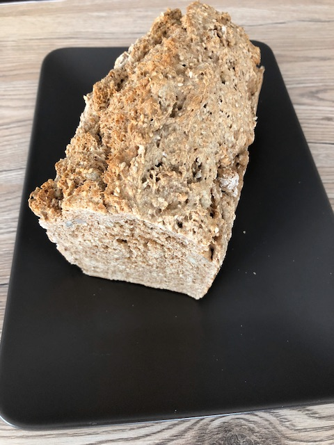

# 3 Minuten Brot

### Zutaten

- [ ]  7 g Hefe (Trockenhefe)
- [ ] 450 ml lauwarmes Wasser
- [ ] 500 g Mehl (Dinkelvollkorn bzw. Weizenvollkorn)
- [ ] 150 g Körner oder Nüsse (z.B. Sonnenblumenkerne, Walnüsse, Sesam, Leinsamen)
- [ ] 2 TL Salz
- [ ] 2 EL Essig (Obstessig)
- [ ] Fett für die Form

### Anleitung

Hefe mit dem Wasser in einer Schüssel verrühren. Alle anderen Zutaten zufügen und gut verarbeiten.  
In eine gefettete Form geben und in den kalten Backofen stellen. Das Brot nicht gehen lassen!  
  
Bei 200°C Ober-/Unterhitze ca. 60 Minuten, bei 170°C Heißluft ca. 50 Minuten backen.  
  
Das Brot aus der Form lösen und evtl. bei Bedarf 10 Minuten nachbacken (beim Gasherd dauert es nur eine Stunde auf 200°C).  
  
Hinweis: Körner können beliebig weggelassen oder ausgetauscht werden.