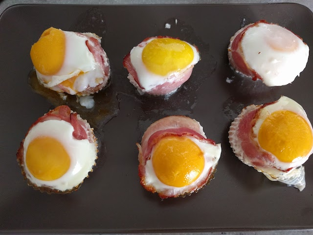

# Bacon Egg Muffins

### Zutaten

Teig
- [ ] Toastbrot
- [ ] Champions oder/und Tomaten
- [ ] Bacon
- [ ] Eier
- [ ] Salz, Pfeffer, Muskat

### Anleitung
Champions oder/und Tomaten in kleine Stückchen schneiden und wegstellen.
Das Toastbrot mit einem Nudelholz etwas dünner Rollen, dann den Toast ausstechen, 
damit dieser die größe des Muffindbodens hat.
Den Toast in die Muffin Form geben und den Rand mit Bacon auslegen, 
es ist praktish wenn ein Teil des Bacons unter dem Toast ist (dadurch kann das Ei nicht durchfließen).
Darauf hin etwas von den gewürzten Tomaten/Champions in die Form geben.
Ein Ei auf die Masse geben.

Alles für ca. 15 Minuten bei 150° in den Ofen.