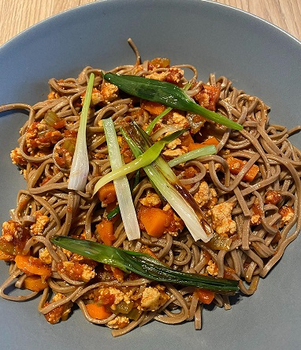

# Asia Tofu Bolognese

### Zutaten
(ca. 2 Personen)

- [ ] 300g Somen oder Soba Nudeln
- [ ] 250g Tofu
- [ ] 50ml Sojasoße
- [ ] 100g Tomatensoße
- [ ] 18ml süße Sojasoße (Ketjap Manis)
- [ ] 15g Ingwer
- [ ] 2 Stangen Fühlingszwiebeln
- [ ] 1 Karotte
- [ ] 1 Knoblauchzehe
- [ ] Salz, Peffer, ggf Chili

### Anleitung
Karotten, Ingwer, Knoblauch, schälen und in klein schneiden. Die Frühlingszwiebeln in Stücke schneiden.
Die Frühlingszwiebeln, in der Pfanne ein wenig anbraten und herausnehmen. Tofu ausdrücken und zerbröseln. 
Gemeinsam mit Karotte, Inger und Knoblauch anbraten, bis der Tofu eine leichte Bräunung erhält.
In einem Topf Wasser aufkochen lassen, die Nudeln hinzugeben und sofort umrühren. Die Nudeln ca. 2min garen,
etwas vom Kochwasser (ca. 200ml) abnehmen. Die Nudeln abgießen und sofort kalt abschrecken. 
Die Nudeln müssen danach kalt sein. Den angebratenen Tofu mit den Soßen und dem Nudelwasser ablöschen und etwas einköckeln lassen.
Nudeln hinzugeben, kurz warm werden lassen und mit den Fühlingszwiebeln toppen.
