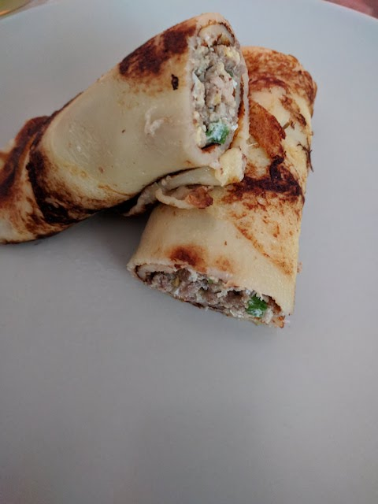

# Gefüllte Pfannkuchen

### Zutaten

Teig
- [ ] 200g Mehl
- [ ] 5	Eier
- [ ] 400 ml Milch
- [ ] Salz
- [ ] 25g Zucker

Füllung
- [ ] 400g Hackfleisch
- [ ] 1/2 Bund Lauchzweiebeln
- [ ] eingeweichtes Brötchen
- [ ] 2 Eier
- [ ] Salz, Pfeffer, Muskat

### Anleitung
Alle Teig Zutaten zusammen verquirlen. Und normale Pfannkuchen Braten.

Das Hackfleisch anbraten, danach Lauchzweiebeln zugeben und kurz mitanbraten.
Das eingeweichte Brötchen ausdrücken und zum Hack dazu geben. Die zwei Eier dazu geben.
Es sollte eine Art klebrige Masse entstehen und nicht all zu trocken sein.

Etwas von der Füllung auf den Pfannkuchen geben und dann einrollen.