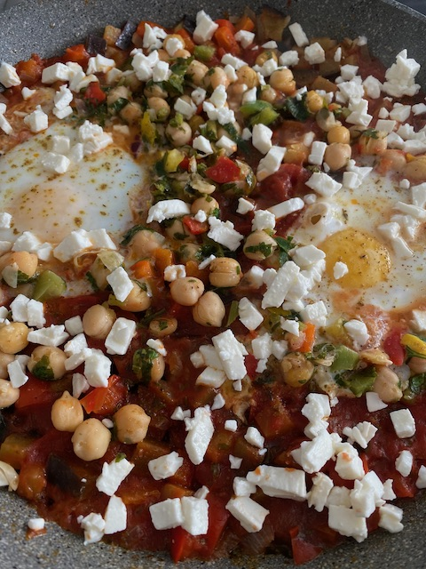

# Mein Shakshuka

### Zutaten
(ca. 4 Personen)

- [ ] 1 Aubergine (400g)
- [ ] 1 rote Paprika
- [ ] 1 Zwiebel
- [ ] 1 Knoblauchzehe
- [ ] 1/2 TL Kreuzkümmel
- [ ] 1 TL Paprikapulver
- [ ] 2 Dosen Pizzatomaten (oder gehackte Tomaten)
- [ ] 6 Eier
- [ ] 150g Feta
- [ ] 150-200g Kichererbsen
- [ ] Salz, Pfeffer

### Anleitung
Auberginen und Paprika waschen, putzen und klein schneiden. Die Zwiebel ebenfalls klein schneiden und den Knoblauch fein würfeln.
Die Zwiebeln leicht andünsten und danach die Aubergine, Paprika sowie den Knoblauch zugeben und etwa 5 Minuten braten.
Alles Würzen sowie Tomaten und Kichererbsen zugeben und 5 Minuten köcheln lassen.

6 Kuhlen für die Eier machen und dort je eines hinein geben. Wenn möglich das Eiweiß etwas über das Eigelb ziehen.
Zugedeckt dann etwa 6Minuten garen bis die Eier anfangen zu stocken. 
Käse drüber geben.
