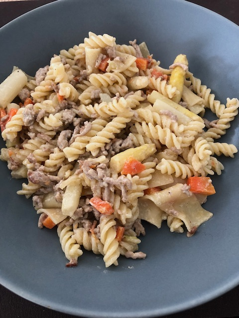

# Spargel Hack Pfanne

### Zutaten
(ca. 2 Personen)

- [ ] 400g Nudeln
- [ ] 250g Spargel
- [ ] 250g Hack
- [ ] 1 Zwiebel
- [ ] 1-2 Karotten
- [ ] 1 EL Schmand
- [ ] Salz, Pfeffer

### Anleitung
Spargel schälen, den holzigen Teil abschneiden/brechen und in Strückchen schneiden. 
Die Karotte ebenfalls Schälen und in stücke schneiden. Die Zwiebel in Würfel schneiden.

Die Nudeln ganz normal in Salzwasser kochen. 
Die Spargelstückchen ebenfalls in etwas Salzwasser kurz ankochen.

Das Hackfleisch mit den Zweibeln anbraten, Karotten zugeben und kurz mitbraten und mit einem schluck wasser ein paar Minuten dünsten lassen.
Spargel sowie Nudeln zur Hack Mischung zugeben. Mit dem Schmand sowie Gewürzen ein paar Minuten ziehen lassen.

