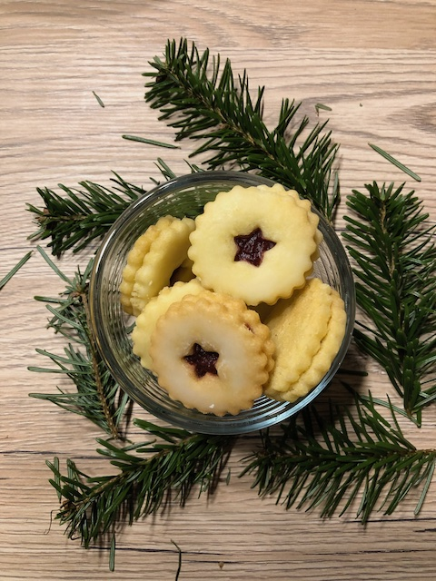

# Hildabretle

### Zutaten

Teig
 - [ ] 250g Butter
 - [ ] 250g Zucker
 - [ ] 1 Ei
 - [ ] 2 Eigelb
 - [ ] 1 EL Sauerrahm/Schmand
 - [ ] 1Päckchen Vanillezucker
 - [ ] 1 TL Backpulver
 - [ ] 500g Mehl
 
 Deko und Füllung
 - [ ] Marmelade
 - [ ] Puderzucker
 - [ ] Zitrone

  
### Anleitung
Alle Teigzutaten miteinander gut verkneten in Folie packen und etwa 1 Stunde kalt stellen.

Var. 1: Ausstechen, anbacken, mit Marmelade bestreichen, zusammen setzen und nochmal für 1-2 Minuten in den Ofen
(Marmelade verteilt sich dann einfach selbst)

Var. 2: Ausstechen, backen, kühlen, mit Marmelade bestreichen und zusammen setzen

Auf Wunsch Zuckerglasur mit Puderzucker und dem Saft einer Zitrone herstellen und bestreichen