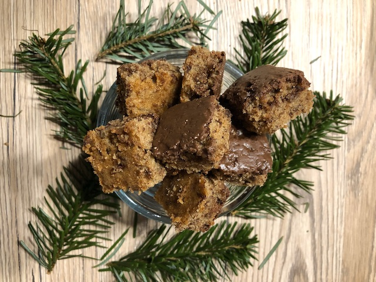

# Schokobrot
Rezept von Oma

### Zutaten

 - [ ] 250g Butter
 - [ ] 250g Zucker
 - [ ] 200g Mandeln
 - [ ] 6 Eier
 - [ ] 150g Mehl
 - [ ] 1 TL Zimtpulver
 - [ ] 250g geriebene Schokolade oder Raspeln 
 - [ ] 1 P Kuvertüre

  
### Anleitung
Bis auf die Kuvertüre alle Zutaten zu einem Teig verühren und diesen auf ein Blech streichen.
Alles bei ca. 180 Grad 20min backen und auskühlen lassen.
Die Kuvertüre schmelzen und über den ausgekühlten Teig verteilen. 
Sofort alles in Würfel schneiden, damit die Schokolade nicht bricht.