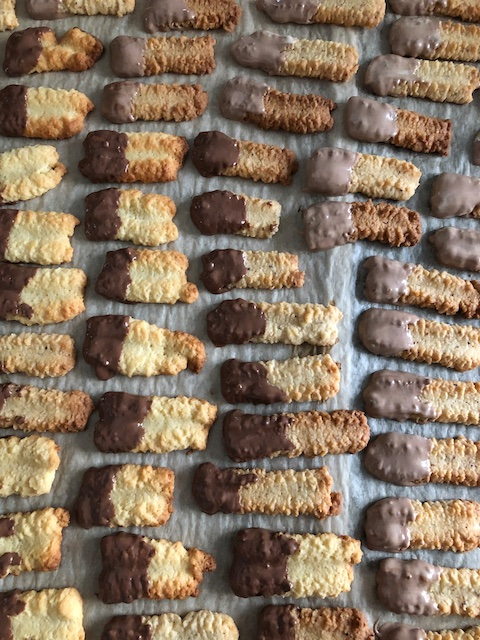

# Spritzgebäck

### Zutaten

Teig
 - [ ] 250g Butter
 - [ ] 250g Zucker
 - [ ] 125g Mandeln
 - [ ] 375g Mehl
 - [ ] 1 EI
 - [ ] 1P Vanillezucker
 
 Deko
 - [ ] Kuvertüre

  
### Anleitung
Alle Zutaten gut miteinander verkneten und den Teig für min. 30min kalt stellen.
Dann den Teig durch eine Spritzbeutel oder mit Hilfe eines Fleischwolfs in Form bringen.
Bei 175 Grad ca 15min backen

Auf Wunsch Teile der Kekse in Kuvertüre tunken.