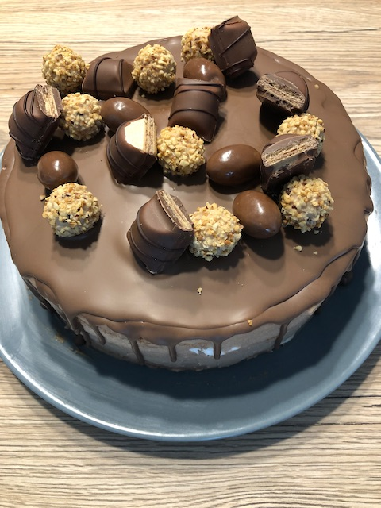

# Bueno Torte

### Zutaten
#### Boden
 - [ ] 6 Eier
 - [ ] 1 Pck. Vanillinzucker
 - [ ] 220g Zucker
 - [ ] 230g Mehl
 - [ ] 50g Schokolade
 - [ ] 2 TL Backpulver

### Creme
 - [ ] 2B Schlagsahne
 - [ ] 2P Sahnesteif oder San Apart
 - [ ] 7 Kinderriegel
 - [ ] 100g Schokobons
 - [ ] ggf. 100g Mascapone

### Deko
 - [ ] 1P Kuvertüre
 - [ ] Schokoriegel
  
### Anleitung
Zu beginn die Sahne erwärmen und Schokoriegel darin schmelzen und abkühlen lassen.

Danach den Boden backen, Eier mit dem Vanillezucker und den Zucker 30 Minuten (!!!!) lang rühren. Am besten in einer Küchenmaschine.
Mehl sieben, mit Backpulver vermischen und unterheben.

Den Boden einer Springform mit Backpapier auslegen und den Teig einfüllen (nicht einfetten!!!). Im vorgeheizten Backofen bei 175°C 50 Minuten backen.

Sobald der Boden ausgekühlt ist in mehrere Böden teilen. Die Schokosahne mit etwas Sahnsteif aufschlagen. Wenn es zu stark Schokoladeig schmeckt, 
kann noch etwas Mascapone dazu gegeben werden.
Die Sahne auf den Böden verteilen und die Torte damit dünn einstreichen.
Alles für ca. 15-20 Minuten nochmals kalt stellen und in der Zeit die Kuvertüre schmelzen lassen, 
diese muss dann ebenfalls noch wenige Minuten auskühlen, da bei heißer Kuvertüre sie Sahnecreme schmelzen würde.
Kuvertüre über Torte geben und mit Schokoriegeln dekorieren.

