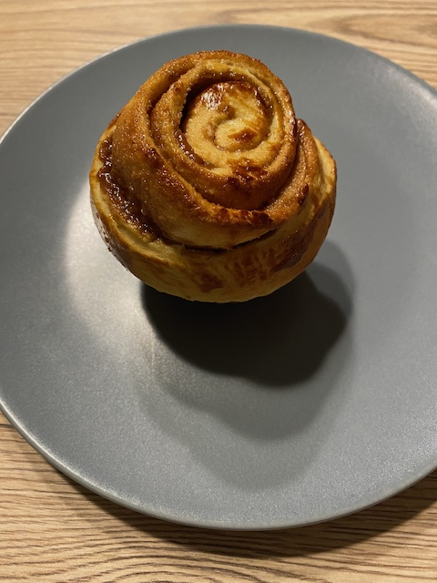

# Lebkuchen Brioches

### Zutaten

 - [ ] 500g	Weizenmehl
 - [ ] 150ml Milch
 - [ ] 100g brauner Zucker
 - [ ] 30g Hefe
 - [ ] 300g Butter
 - [ ] 100g Marzipanrohmasse
 - [ ] 50g Ahornsirup
 - [ ] 1 EL Lebkuchengewürz
 - [ ] 2 EL Kakao
 - [ ] 1 TL Zimt
 - [ ] 3 Eier
 - [ ] 1 Eiegelb

  
### Anleitung
Marzipan in einen Topf reiben und mit Ahornsirup sowie 50g Zucker, Kakao, 100g Butter, Lebkuchengewürz und Zimt erwärmen
und abkühlen lassen.

Die Hefe in etwas lauwarmer Milch auflösen. Das Mehl mit dem restlichen Zucker mischen und einen Mulde hinein drücken.
Hefemilch in die mulde geben und mit etwas Mehl verrühren. Diesen Vorteig dann ca 30 Minuten an einem warmen Ort gehen lassen.

Die Eier mit 200g Butter und einer priese Salz zum Vorteig geben und alles gut verkneten. 
Alles nochmal ca. 30 Minuten abgedeckt gehen lassen.

Den Teig ausrollen, mit der Lebkuchenbutter bestreichen und von der Längsseite her aufrollen. 
Die Teigrolle in Stücke schneiden und in gut gebutterte Broiche oder Muffinförmchen geben.
Das Eigelb verquirlen und damit die Broiche bestreichen. 

Bei 180 Grad ca. 25min goldbraun backen.