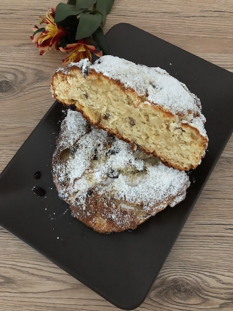

# Quarkstollen

### Zutaten

Teig
 - [ ] 500g Mehl
 - [ ] 120g Mehl
 - [ ] 1P Vanillezucker
 - [ ] 50g Zitronat
 - [ ] 50g Orangat
 - [ ] 1 Fläschchen Rumaroma
 - [ ] 1 Fläschchen Bittermandel
 - [ ] 1 Fläschchen Zitronenaroma
 - [ ] 250g Quark
 - [ ] 50g Butter
 - [ ] 125g Magerine
 - [ ] 1 Ei
 - [ ] 5 EL Milch
 - [ ] 200g Rosinen
 
 Deko
 - [ ] Butter
 - [ ] Puderzucker
 

  
### Anleitung
Alle Teigzutaten gut miteinander verkneten und auf einem Blech zu zwei Stollen formen (Teig ist leicht klebrig).
Da die Rosinen schnell dunkel werden, am besten vor dem Backen inn den Teig drücken, damit sie bedeckt sind.
Bei mittlerer Hitze ca. 1 Std backen und etwas auskühlen lassen. 

Danach mit zerlassener Butter bestreichen und mit Puderzucker bestreuen.