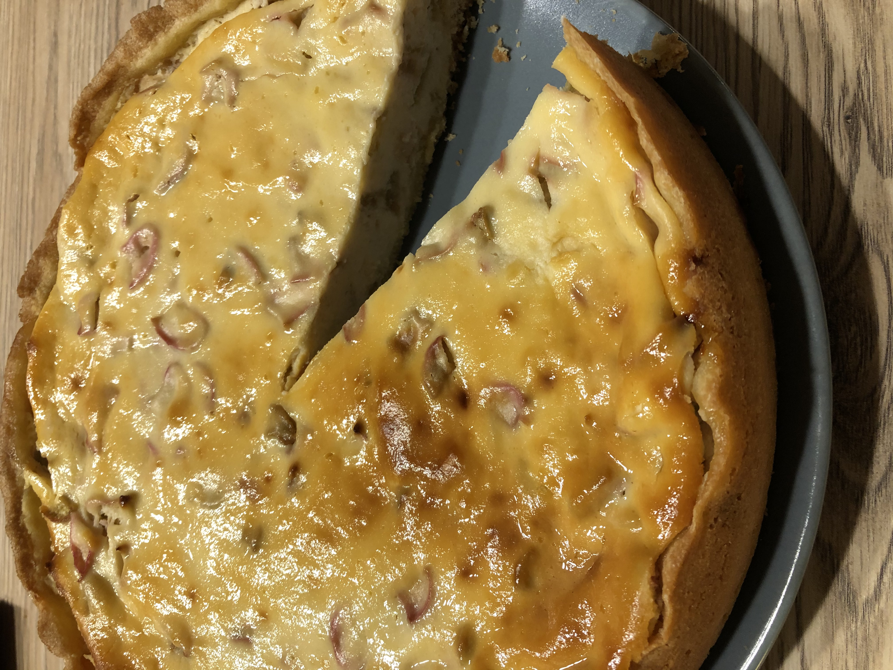

# Rhababer-Käsekuchen

### Zutaten

Boden:
 - [ ] 150 g Mehl
 - [ ] 60 g Butter 
 - [ ] 50 g Zucker 
 - [ ] 1Ei

Füllung: 
 - [ ] 500 g Quark (Magerquark)
 - [ ] 250 g Buttermilch
 - [ ] 150 g Zucker
 - [ ] 75 g Mehl
 - [ ] 2 Eier
 - [ ] 1 Pck. Vanillinzucker
 - [ ] 1 Zitrone(n), unbehandelt, die Schale davon
 - [ ] 400g Rhabarber

### Anleitung
Das Mehl mit Butter, Zucker und Ei zu einem Mürbeteig verkneten und 30 Minuten kalt stellen.  
  
Unterdessen den Rhabarber säubern und in mundgerechte Stücke schneiden.  
Die restlichen Zutaten zu einer homogenen Masse verrühren.  
  
Den Mürbeteig ausrollen und eine gefettete Springform (28 cm) damit auskleiden.  
  
Die Rhabarberstücke in die Füllung rühren und schließlich alles auf dem Mürbeteig verteilen.  
  
Den Kuchen 30 - 40 Minuten backen, so lange, bis sich die Füllung auch in der Mitte fest anfühlt.  
  
Schmeckt am besten gut gekühlt.
