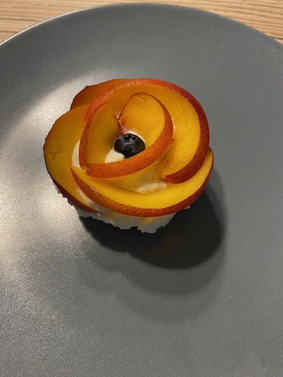

# Creme Törtchen ohne Backen

### Zutaten

 - [ ] 1/2 Päckchen Butterkekse
 - [ ] 100g Butter
 - [ ] 1 Becher Sahne
 - [ ] 1/2 Päckchen Quark
 - [ ] 1/2 Päckchen Mascapone
 - [ ] 1P Gelantine Fix
 - [ ] 150g Zucker
 - [ ] Obst zum dekorieren
 

  
### Anleitung
Die Butterkekse zerbröseln und währenddessen die Butter schmelzen. 
Butter sowie Kekse miteinander vermischen und in Muffin Förmchen geben.
Die Sahne schlagen. Quark, Mascapone und Zucker mischen. 
Danach Limette bzw Zitrone auspressen und in die Quark Mischung geben.
Zur Creme das Gelantine Fix hinzu geben und die Sahne unterheben. Creme auf Muffin Förmchen verteilen und mit OBst dekorieren.
Alles ca. 1h im Kühlschrank fest werden lassen