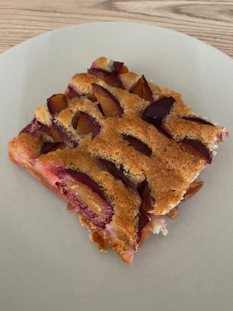

# Zwetschgen vom Blech

### Zutaten

 - [ ] 250g Zucker
 - [ ] 125g Butter
 - [ ] 100ml Milch
 - [ ] 200g Mehl
 - [ ] 100g gemahlene Mandeln oder Haselnüsse
 - [ ] 4 Eier
 - [ ] 1,5 kg Zwetschgen
 - [ ] 3 TL Backpulver
 - [ ] Zimt / Zucker
 

  
### Anleitung
Backofen auf 200 Grad vorheizen. Backblech mit Backpapier auslegen.
Eier und Zucker schaumig schlagen. Butter mit Milch zum kochen bringen und dann zur Ei-Zucker masse geben.
Mehl und Backpulver unterheben und gleichmäßig auf dem Backblech verteilen.
Zwetschgen waschen und in Spalten schneiden, damit den Teig belegen. Alles ca. 25-30min backen.

Nachdem Backen mit Zimt Zucker bestreuen